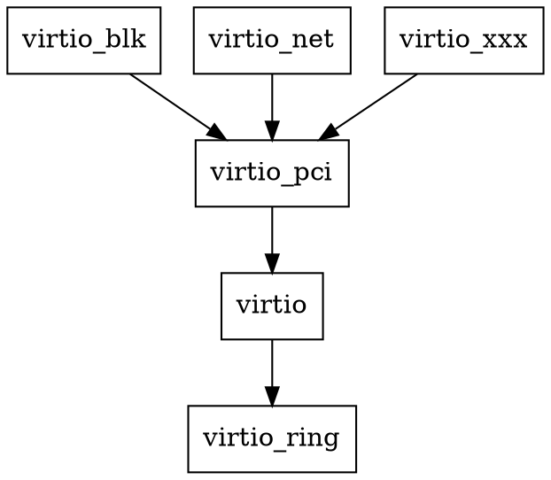
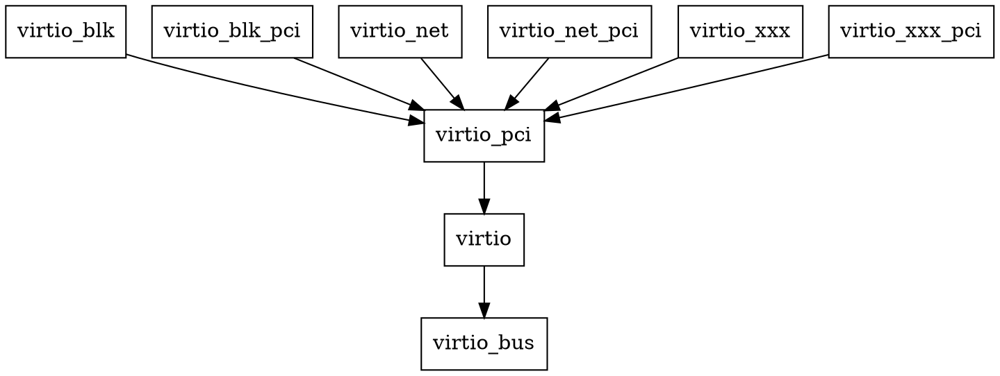

# virtio
virtio是linux中一种半虚拟化的IO框架，可以用于软件模拟各种硬件设备。其实现可以分为前端和后端两部分：
* virtio前端：由linux中virtio驱动实现，用于和系统中各类IO对接，比如磁盘IO、网络IO等;
* virtio后端：通常在qemu中实现，用于软件模拟各类硬件设备。
virtio框架中包含的组件有：
* device status field
* feature bits
* notifications
* device configuration
* virtqueues

下文从前端和后端的角度结合代码分析virtio的具体实现。

## virtio前端
virtio前端驱动分层实现：
顶层为virtio_blk、virito_net等和具体设备相关的操作实现;
另外还有和传输相关的实现，virtio1.1支持的传输方式有PCI，MMIO和Channel IO，这里主要关注pci传输方式，实现在virtio-pci中;
virtio框架相关的核心操作在virtio和virtio_ring中实现，virtio_ring中主要实现了virtqueue的相关操作。


## virtio后端
virtio后端实现了设备的模拟，qemu中virtio后端也采用了分层的方式：
顶层也是和设备相关的模拟，具体在virtio-blk、virtio-net等文件中实现;对于pci的传输方式，还有在对应的virtio-blk-pci、virtio-net-pci等文件中实现pci相关操作;
与传输相关的操作在virtio-pci中实现;
virtio框架相关的操作在virtio中实现，其中virtio设备被抽象为挂载在virtio-bus上，相关操作在virtio-bus中实现。

下文以qemu-5.0中virtio-blk实现为例分析各层的实现。

### virtio-blk
在qemu启动过程中会调用`type_register_static()`注册`virtio_blk_info`结构体，该结构体中分别包含了`virtio_blk_class_init()`和`virtio_blk_instance_init()`两个函数指针，其中`virtio_blk_class_init()`在qemu启动过程中被调用，`virtio_blk_instance_init()`函数在qemu执行`device_add`过程中被调用。`virtio_blk_class_init()`提供了对virtio设备的关键操作，其实现如下：
```C
static void virtio_blk_class_init(ObjectClass *klass, void *data)
{
    DeviceClass *dc = DEVICE_CLASS(klass);
    VirtioDeviceClass *vdc = VIRTIO_DEVICE_CLASS(klass);

    device_class_set_props(dc, virtio_blk_properties);
    dc->vmsd = &vmstate_virtio_blk;
    set_bit(DEVICE_CATEGORY_STORAGE, dc->categories);
    vdc->realize = virtio_blk_device_realize;
    vdc->unrealize = virtio_blk_device_unrealize;
    vdc->get_config = virtio_blk_update_config;
    vdc->set_config = virtio_blk_set_config;
    vdc->get_features = virtio_blk_get_features;
    vdc->set_status = virtio_blk_set_status;
    vdc->reset = virtio_blk_reset;
    vdc->save = virtio_blk_save_device;
    vdc->load = virtio_blk_load_device;
    vdc->start_ioeventfd = virtio_blk_data_plane_start;
    vdc->stop_ioeventfd = virtio_blk_data_plane_stop;
}
```
其中`DeviceClass`是qemu中表示设备类型的数据结构;`VirtioDeviceClass`是针对virtio设备的数据结构，结构体中的函数指针指向的函数实现对`device status`、`feature bits`、`notifications`、`device configuration`和`virtqueue`等virtio组件的操作方式。

### virtio-pci
在virtio-pci中注册了`virtio_pci_bus_info`和`virtio_pci_info`两个结构体。
`virtio_pci_bus_info`中主要指定了virtio-bus与pci相对应的操作。
`virtio_pci_info`中指定了virtio-pci设备的通用初始化操作，比如设备的实现、退出和复位等;
另外，该文件中还定义了特定类型设备pci操作的接口，在`virtio_pci_types_register()`函数中，该函数会在具体设备`virtio-xxx-pci`对应的实现中被调用。
`virtio_pci_types_register()`传入参数为`VirtioPCIDeviceTypeInfo`，中注册了4个结构体：
* `base_type_info`：通用基类
* `generic_type_info`：普通设备类型（可选）
* `non_transitional_type_info`：PCIE设备类型（可选）
* `transitional_type_info`：PCI设备类型（可选）

### virtio-blk-pci
`virtio-blk-pci`中定义了`virtio_blk_pci_info`变量，并将其作为传入参数调用`virtio_pci_types_register()`函数，完成virtio-pci设备的注册。

### virtio-bus
在virtio-bus中注册了`virtio_bus_info`结构体，其中指定了virtio-bus的类初始化函数`virtio_bus_class_init()`，主要提供了设备的路径查询操作。
另外，该文件中还提供了总线上设备的添加、配置、通知等操作的函数。

### 代码执行流
在qemu启动过程中，各模块中的`type_init()`和`type_register()`函数会被执行，将定义的数据类型添加到一个Hash表中。
之后各个数据结构中指定的`xxx_class_init()`函数会被调用，以`virtio_blk_pci_class_init()`函数为例，其函数调用栈如下：
```
#0  virtio_blk_pci_class_init (klass=0x5555569b7930, data=0x0) at ../hw/virtio/virtio-blk-pci.c:69
#1  0x00005555559b51f0 in virtio_pci_base_class_init (klass=0x5555569b7930, data=0x5555567a6680 <virtio_blk_pci_info>) at ../hw/virtio/virtio-pci.c:2003
#2  0x0000555555cfa929 in type_initialize (ti=0x555556960870) at ../qom/object.c:364
#3  0x0000555555cfa694 in type_initialize (ti=0x555556960e10) at ../qom/object.c:312
#4  0x0000555555cfc093 in object_class_foreach_tramp (key=0x555556960f90, value=0x555556960e10, opaque=0x7fffffffd710) at ../qom/object.c:1069
#5  0x00007ffff6e373f0 in g_hash_table_foreach () from /lib/x86_64-linux-gnu/libglib-2.0.so.0
#6  0x0000555555cfc172 in object_class_foreach (fn=0x555555cfc2cf <object_class_get_list_tramp>, implements_type=0x55555602dbce "machine", include_abstract=false, opaque=0x7fffffffd760) at ../qom/object.c:1091
#7  0x0000555555cfc34d in object_class_get_list (implements_type=0x55555602dbce "machine", include_abstract=false) at ../qom/object.c:1148
#8  0x0000555555c86d39 in select_machine () at ../softmmu/vl.c:1616
#9  0x0000555555c8b601 in qemu_init (argc=10, argv=0x7fffffffda08, envp=0x7fffffffda60) at ../softmmu/vl.c:3545
#10 0x00005555558147e8 in main (argc=10, argv=0x7fffffffda08, envp=0x7fffffffda60) at ../softmmu/main.c:49
```

在添加设备过程中`virtio_xxx_instance_init()`函数会被调用，创建设备实例。以virtio-blk设备添加为例，采用qmp接口调用`device_add`命令添加设备时，`virtio_blk_pci_instance_init()`和`virtio_blk_instance_init()`函数会先后被调用，完成新设备的创建，两个函数的调用栈如下：
```c
// virtio_blk_pci_instance_init()
#0  virtio_blk_pci_instance_init (obj=0x555556bb0820) at ../hw/virtio/virtio-blk-pci.c:86
#1  0x0000555555cfa98f in object_init_with_type (obj=0x555556bb0820, ti=0x555556960870) at ../qom/object.c:375
#2  0x0000555555cfa971 in object_init_with_type (obj=0x555556bb0820, ti=0x555556960a30) at ../qom/object.c:371
#3  0x0000555555cfaecc in object_initialize_with_type (obj=0x555556bb0820, size=33824, type=0x555556960a30) at ../qom/object.c:517
#4  0x0000555555cfb5cd in object_new_with_type (type=0x555556960a30) at ../qom/object.c:732
#5  0x0000555555cfb624 in object_new (typename=0x555557548fd0 "virtio-blk-pci") at ../qom/object.c:747
#6  0x0000555555defc74 in qdev_new (name=0x555557548fd0 "virtio-blk-pci") at ../hw/core/qdev.c:153
#7  0x00005555559ff612 in qdev_device_add (opts=0x555556b6d4b0, errp=0x7fffffffc4e0) at ../softmmu/qdev-monitor.c:651
#8  0x00005555559ffd21 in qmp_device_add (qdict=0x55555797c420, ret_data=0x0, errp=0x7fffffffc4e0) at ../softmmu/qdev-monitor.c:804
#9  0x0000555555a0015b in hmp_device_add (mon=0x555556b8ff10, qdict=0x55555797c420) at ../softmmu/qdev-monitor.c:915
#10 0x0000555555a5a4d5 in handle_hmp_command (mon=0x555556b8ff10, cmdline=0x555556b9600b "virtio-blk-pci,drive=disk1,id=myvirtio1") at ../monitor/hmp.c:1105
#11 0x0000555555a57c0e in monitor_command_cb (opaque=0x555556b8ff10, cmdline=0x555556b96000 "device_add virtio-blk-pci,drive=disk1,id=myvirtio1", readline_opaque=0x0) at ../monitor/hmp.c:48
#12 0x0000555555ec45d2 in readline_handle_byte (rs=0x555556b96000, ch=13) at ../util/readline.c:411
#13 0x0000555555a5b015 in monitor_read (opaque=0x555556b8ff10, buf=0x7fffffffc760 "\r\320\377\377\377\177", size=1) at ../monitor/hmp.c:1343
#14 0x0000555555dfcb76 in mux_chr_read (opaque=0x555556b8fc10, buf=0x7fffffffc760 "\r\320\377\377\377\177", size=1) at ../chardev/char-mux.c:235
#15 0x0000555555dfd884 in qemu_chr_be_write_impl (s=0x555556b8eac0, buf=0x7fffffffc760 "\r\320\377\377\377\177", len=1) at ../chardev/char.c:202
#16 0x0000555555dfd8eb in qemu_chr_be_write (s=0x555556b8eac0, buf=0x7fffffffc760 "\r\320\377\377\377\177", len=1) at ../chardev/char.c:214
#17 0x0000555555dfb3e0 in fd_chr_read (chan=0x555556b8eba0, cond=G_IO_IN, opaque=0x555556b8eac0) at ../chardev/char-fd.c:68
#18 0x0000555555d08f01 in qio_channel_fd_source_dispatch (source=0x555557083a40, callback=0x555555dfb2b6 <fd_chr_read>, user_data=0x555556b8eac0) at ../io/channel-watch.c:84
#19 0x00007ffff6e4811a in g_main_context_dispatch () from /lib/x86_64-linux-gnu/libglib-2.0.so.0
#20 0x0000555555ee89eb in glib_pollfds_poll () at ../util/main-loop.c:231
#21 0x0000555555ee8a65 in os_host_main_loop_wait (timeout=3748674) at ../util/main-loop.c:254
#22 0x0000555555ee8b6d in main_loop_wait (nonblocking=0) at ../util/main-loop.c:530
#23 0x0000555555bdab60 in qemu_main_loop () at ../softmmu/runstate.c:725
#24 0x00005555558147ed in main (argc=10, argv=0x7fffffffda08, envp=0x7fffffffda60) at ../softmmu/main.c:50
// virtio_blk_instance_init()
#0  virtio_blk_instance_init (obj=0x555556bb89c0) at ../hw/block/virtio-blk.c:1268
#1  0x0000555555cfa98f in object_init_with_type (obj=0x555556bb89c0, ti=0x55555695e850) at ../qom/object.c:375
#2  0x0000555555cfaecc in object_initialize_with_type (obj=0x555556bb89c0, size=632, type=0x55555695e850) at ../qom/object.c:517
#3  0x0000555555cfaf41 in object_initialize (data=0x555556bb89c0, size=632, typename=0x555556012c89 "virtio-blk-device") at ../qom/object.c:536
#4  0x0000555555cfb07f in object_initialize_child_with_propsv (parentobj=0x555556bb0820, propname=0x555556038256 "virtio-backend", childobj=0x555556bb89c0, size=632, type=0x555556012c89 "virtio-blk-device", errp=0x5555568ee010 <error_abort>, vargs=0x7fffffffc1d0) at ../qom/object.c:566
#5  0x0000555555cfb01a in object_initialize_child_with_props (parentobj=0x555556bb0820, propname=0x555556038256 "virtio-backend", childobj=0x555556bb89c0, size=632, type=0x555556012c89 "virtio-blk-device", errp=0x5555568ee010 <error_abort>) at ../qom/object.c:549
#6  0x0000555555c95ca8 in virtio_instance_init_common (proxy_obj=0x555556bb0820, data=0x555556bb89c0, vdev_size=632, vdev_name=0x555556012c89 "virtio-blk-device") at ../hw/virtio/virtio.c:3237
#7  0x0000555555bd9385 in virtio_blk_pci_instance_init (obj=0x555556bb0820) at ../hw/virtio/virtio-blk-pci.c:86
#8  0x0000555555cfa98f in object_init_with_type (obj=0x555556bb0820, ti=0x555556960870) at ../qom/object.c:375
#9  0x0000555555cfa971 in object_init_with_type (obj=0x555556bb0820, ti=0x555556960a30) at ../qom/object.c:371
#10 0x0000555555cfaecc in object_initialize_with_type (obj=0x555556bb0820, size=33824, type=0x555556960a30) at ../qom/object.c:517
#11 0x0000555555cfb5cd in object_new_with_type (type=0x555556960a30) at ../qom/object.c:732
#12 0x0000555555cfb624 in object_new (typename=0x555557548fd0 "virtio-blk-pci") at ../qom/object.c:747
#13 0x0000555555defc74 in qdev_new (name=0x555557548fd0 "virtio-blk-pci") at ../hw/core/qdev.c:153
#14 0x00005555559ff612 in qdev_device_add (opts=0x555556b6d4b0, errp=0x7fffffffc4e0) at ../softmmu/qdev-monitor.c:651
#15 0x00005555559ffd21 in qmp_device_add (qdict=0x55555797c420, ret_data=0x0, errp=0x7fffffffc4e0) at ../softmmu/qdev-monitor.c:804
#16 0x0000555555a0015b in hmp_device_add (mon=0x555556b8ff10, qdict=0x55555797c420) at ../softmmu/qdev-monitor.c:915
#17 0x0000555555a5a4d5 in handle_hmp_command (mon=0x555556b8ff10, cmdline=0x555556b9600b "virtio-blk-pci,drive=disk1,id=myvirtio1") at ../monitor/hmp.c:1105
#18 0x0000555555a57c0e in monitor_command_cb (opaque=0x555556b8ff10, cmdline=0x555556b96000 "device_add virtio-blk-pci,drive=disk1,id=myvirtio1", readline_opaque=0x0) at ../monitor/hmp.c:48
#19 0x0000555555ec45d2 in readline_handle_byte (rs=0x555556b96000, ch=13) at ../util/readline.c:411
#20 0x0000555555a5b015 in monitor_read (opaque=0x555556b8ff10, buf=0x7fffffffc760 "\r\320\377\377\377\177", size=1) at ../monitor/hmp.c:1343
#21 0x0000555555dfcb76 in mux_chr_read (opaque=0x555556b8fc10, buf=0x7fffffffc760 "\r\320\377\377\377\177", size=1) at ../chardev/char-mux.c:235
#22 0x0000555555dfd884 in qemu_chr_be_write_impl (s=0x555556b8eac0, buf=0x7fffffffc760 "\r\320\377\377\377\177", len=1) at ../chardev/char.c:202
#23 0x0000555555dfd8eb in qemu_chr_be_write (s=0x555556b8eac0, buf=0x7fffffffc760 "\r\320\377\377\377\177", len=1) at ../chardev/char.c:214
#24 0x0000555555dfb3e0 in fd_chr_read (chan=0x555556b8eba0, cond=G_IO_IN, opaque=0x555556b8eac0) at ../chardev/char-fd.c:68
#25 0x0000555555d08f01 in qio_channel_fd_source_dispatch (source=0x555557083a40, callback=0x555555dfb2b6 <fd_chr_read>, user_data=0x555556b8eac0) at ../io/channel-watch.c:84
#26 0x00007ffff6e4811a in g_main_context_dispatch () from /lib/x86_64-linux-gnu/libglib-2.0.so.0
#27 0x0000555555ee89eb in glib_pollfds_poll () at ../util/main-loop.c:231
#28 0x0000555555ee8a65 in os_host_main_loop_wait (timeout=3748674) at ../util/main-loop.c:254
#29 0x0000555555ee8b6d in main_loop_wait (nonblocking=0) at ../util/main-loop.c:530
#30 0x0000555555bdab60 in qemu_main_loop () at ../softmmu/runstate.c:725
#31 0x00005555558147ed in main (argc=10, argv=0x7fffffffda08, envp=0x7fffffffda60) at ../softmmu/main.c:50
```

新设备实例初始化完成后，会调用`virtio_xxx_realize()`完成设备配置。以virtio-blk为例，在示例初始化完成后会分别调用`virtio_blk_pci_realize()`函数和`virtio_blk_realize()`函数进行设备配置。两个函数的函数调用栈如下：
```c
// virtio_blk_pci_realize
#0  virtio_blk_pci_realize (vpci_dev=0x555556bb0820, errp=0x7fffffffc178) at ../hw/virtio/virtio-blk-pci.c:52
#1  0x00005555559b4cd1 in virtio_pci_realize (pci_dev=0x555556bb0820, errp=0x7fffffffc178) at ../hw/virtio/virtio-pci.c:1878
#2  0x00005555558e8117 in pci_qdev_realize (qdev=0x555556bb0820, errp=0x7fffffffc230) at ../hw/pci/pci.c:2117
#3  0x00005555559b50e3 in virtio_pci_dc_realize (qdev=0x555556bb0820, errp=0x7fffffffc230) at ../hw/virtio/virtio-pci.c:1963
#4  0x0000555555df133f in device_set_realized (obj=0x555556bb0820, value=true, errp=0x7fffffffc338) at ../hw/core/qdev.c:761
#5  0x0000555555cfebd0 in property_set_bool (obj=0x555556bb0820, v=0x55555735ce70, name=0x5555560846b9 "realized", opaque=0x5555569787a0, errp=0x7fffffffc338) at ../qom/object.c:2257
#6  0x0000555555cfcce5 in object_property_set (obj=0x555556bb0820, name=0x5555560846b9 "realized", v=0x55555735ce70, errp=0x7fffffffc4e0) at ../qom/object.c:1402
#7  0x0000555555d01021 in object_property_set_qobject (obj=0x555556bb0820, name=0x5555560846b9 "realized", value=0x5555574bb080, errp=0x7fffffffc4e0) at ../qom/qom-qobject.c:28
#8  0x0000555555cfd04b in object_property_set_bool (obj=0x555556bb0820, name=0x5555560846b9 "realized", value=true, errp=0x7fffffffc4e0) at ../qom/object.c:1472
#9  0x0000555555df03c5 in qdev_realize (dev=0x555556bb0820, bus=0x555556ce44b0, errp=0x7fffffffc4e0) at ../hw/core/qdev.c:389
#10 0x00005555559ff6fc in qdev_device_add (opts=0x5555577f46c0, errp=0x7fffffffc4e0) at ../softmmu/qdev-monitor.c:675
#11 0x00005555559ffd21 in qmp_device_add (qdict=0x55555797c420, ret_data=0x0, errp=0x7fffffffc4e0) at ../softmmu/qdev-monitor.c:804
#12 0x0000555555a0015b in hmp_device_add (mon=0x555556b8ff10, qdict=0x55555797c420) at ../softmmu/qdev-monitor.c:915
#13 0x0000555555a5a4d5 in handle_hmp_command (mon=0x555556b8ff10, cmdline=0x555556b9600b "virtio-blk-pci,drive=disk1,id=myvirtio1") at ../monitor/hmp.c:1105
#14 0x0000555555a57c0e in monitor_command_cb (opaque=0x555556b8ff10, cmdline=0x555556b96000 "device_add virtio-blk-pci,drive=disk1,id=myvirtio1", readline_opaque=0x0) at ../monitor/hmp.c:48
#15 0x0000555555ec45d2 in readline_handle_byte (rs=0x555556b96000, ch=13) at ../util/readline.c:411
#16 0x0000555555a5b015 in monitor_read (opaque=0x555556b8ff10, buf=0x7fffffffc760 "\r\320\377\377\377\177", size=1) at ../monitor/hmp.c:1343
#17 0x0000555555dfcb76 in mux_chr_read (opaque=0x555556b8fc10, buf=0x7fffffffc760 "\r\320\377\377\377\177", size=1) at ../chardev/char-mux.c:235
#18 0x0000555555dfd884 in qemu_chr_be_write_impl (s=0x555556b8eac0, buf=0x7fffffffc760 "\r\320\377\377\377\177", len=1) at ../chardev/char.c:202
#19 0x0000555555dfd8eb in qemu_chr_be_write (s=0x555556b8eac0, buf=0x7fffffffc760 "\r\320\377\377\377\177", len=1) at ../chardev/char.c:214
#20 0x0000555555dfb3e0 in fd_chr_read (chan=0x555556b8eba0, cond=G_IO_IN, opaque=0x555556b8eac0) at ../chardev/char-fd.c:68
#21 0x0000555555d08f01 in qio_channel_fd_source_dispatch (source=0x5555579ddb20, callback=0x555555dfb2b6 <fd_chr_read>, user_data=0x555556b8eac0) at ../io/channel-watch.c:84
#22 0x00007ffff6e4811a in g_main_context_dispatch () from /lib/x86_64-linux-gnu/libglib-2.0.so.0
#23 0x0000555555ee89eb in glib_pollfds_poll () at ../util/main-loop.c:231
#24 0x0000555555ee8a65 in os_host_main_loop_wait (timeout=17276804) at ../util/main-loop.c:254
#25 0x0000555555ee8b6d in main_loop_wait (nonblocking=0) at ../util/main-loop.c:530
#26 0x0000555555bdab60 in qemu_main_loop () at ../softmmu/runstate.c:725
#27 0x00005555558147ed in main (argc=10, argv=0x7fffffffda08, envp=0x7fffffffda60) at ../softmmu/main.c:50

// virtio_blk_device_realize
#0  virtio_blk_device_realize (dev=0x555556bb89c0, errp=0x7fffffffbe80) at ../hw/block/virtio-blk.c:1146
#1  0x0000555555c96dd6 in virtio_device_realize (dev=0x555556bb89c0, errp=0x7fffffffbee0) at ../hw/virtio/virtio.c:3660
#2  0x0000555555df133f in device_set_realized (obj=0x555556bb89c0, value=true, errp=0x7fffffffbfe8) at ../hw/core/qdev.c:761
#3  0x0000555555cfebd0 in property_set_bool (obj=0x555556bb89c0, v=0x5555579dc400, name=0x5555560846b9 "realized", opaque=0x5555569787a0, errp=0x7fffffffbfe8) at ../qom/object.c:2257
#4  0x0000555555cfcce5 in object_property_set (obj=0x555556bb89c0, name=0x5555560846b9 "realized", v=0x5555579dc400, errp=0x7fffffffc178) at ../qom/object.c:1402
#5  0x0000555555d01021 in object_property_set_qobject (obj=0x555556bb89c0, name=0x5555560846b9 "realized", value=0x55555797d520, errp=0x7fffffffc178) at ../qom/qom-qobject.c:28
#6  0x0000555555cfd04b in object_property_set_bool (obj=0x555556bb89c0, name=0x5555560846b9 "realized", value=true, errp=0x7fffffffc178) at ../qom/object.c:1472
#7  0x0000555555df03c5 in qdev_realize (dev=0x555556bb89c0, bus=0x555556bb8938, errp=0x7fffffffc178) at ../hw/core/qdev.c:389
#8  0x0000555555bd9294 in virtio_blk_pci_realize (vpci_dev=0x555556bb0820, errp=0x7fffffffc178) at ../hw/virtio/virtio-blk-pci.c:64
#9  0x00005555559b4cd1 in virtio_pci_realize (pci_dev=0x555556bb0820, errp=0x7fffffffc178) at ../hw/virtio/virtio-pci.c:1878
#10 0x00005555558e8117 in pci_qdev_realize (qdev=0x555556bb0820, errp=0x7fffffffc230) at ../hw/pci/pci.c:2117
#11 0x00005555559b50e3 in virtio_pci_dc_realize (qdev=0x555556bb0820, errp=0x7fffffffc230) at ../hw/virtio/virtio-pci.c:1963
#12 0x0000555555df133f in device_set_realized (obj=0x555556bb0820, value=true, errp=0x7fffffffc338) at ../hw/core/qdev.c:761
#13 0x0000555555cfebd0 in property_set_bool (obj=0x555556bb0820, v=0x55555735ce70, name=0x5555560846b9 "realized", opaque=0x5555569787a0, errp=0x7fffffffc338) at ../qom/object.c:2257
#14 0x0000555555cfcce5 in object_property_set (obj=0x555556bb0820, name=0x5555560846b9 "realized", v=0x55555735ce70, errp=0x7fffffffc4e0) at ../qom/object.c:1402
#15 0x0000555555d01021 in object_property_set_qobject (obj=0x555556bb0820, name=0x5555560846b9 "realized", value=0x5555574bb080, errp=0x7fffffffc4e0) at ../qom/qom-qobject.c:28
#16 0x0000555555cfd04b in object_property_set_bool (obj=0x555556bb0820, name=0x5555560846b9 "realized", value=true, errp=0x7fffffffc4e0) at ../qom/object.c:1472
#17 0x0000555555df03c5 in qdev_realize (dev=0x555556bb0820, bus=0x555556ce44b0, errp=0x7fffffffc4e0) at ../hw/core/qdev.c:389
#18 0x00005555559ff6fc in qdev_device_add (opts=0x5555577f46c0, errp=0x7fffffffc4e0) at ../softmmu/qdev-monitor.c:675
#19 0x00005555559ffd21 in qmp_device_add (qdict=0x55555797c420, ret_data=0x0, errp=0x7fffffffc4e0) at ../softmmu/qdev-monitor.c:804
#20 0x0000555555a0015b in hmp_device_add (mon=0x555556b8ff10, qdict=0x55555797c420) at ../softmmu/qdev-monitor.c:915
#21 0x0000555555a5a4d5 in handle_hmp_command (mon=0x555556b8ff10, cmdline=0x555556b9600b "virtio-blk-pci,drive=disk1,id=myvirtio1") at ../monitor/hmp.c:1105
#22 0x0000555555a57c0e in monitor_command_cb (opaque=0x555556b8ff10, cmdline=0x555556b96000 "device_add virtio-blk-pci,drive=disk1,id=myvirtio1", readline_opaque=0x0) at ../monitor/hmp.c:48
#23 0x0000555555ec45d2 in readline_handle_byte (rs=0x555556b96000, ch=13) at ../util/readline.c:411
#24 0x0000555555a5b015 in monitor_read (opaque=0x555556b8ff10, buf=0x7fffffffc760 "\r\320\377\377\377\177", size=1) at ../monitor/hmp.c:1343
#25 0x0000555555dfcb76 in mux_chr_read (opaque=0x555556b8fc10, buf=0x7fffffffc760 "\r\320\377\377\377\177", size=1) at ../chardev/char-mux.c:235
#26 0x0000555555dfd884 in qemu_chr_be_write_impl (s=0x555556b8eac0, buf=0x7fffffffc760 "\r\320\377\377\377\177", len=1) at ../chardev/char.c:202
#27 0x0000555555dfd8eb in qemu_chr_be_write (s=0x555556b8eac0, buf=0x7fffffffc760 "\r\320\377\377\377\177", len=1) at ../chardev/char.c:214
#28 0x0000555555dfb3e0 in fd_chr_read (chan=0x555556b8eba0, cond=G_IO_IN, opaque=0x555556b8eac0) at ../chardev/char-fd.c:68
#29 0x0000555555d08f01 in qio_channel_fd_source_dispatch (source=0x5555579ddb20, callback=0x555555dfb2b6 <fd_chr_read>, user_data=0x555556b8eac0) at ../io/channel-watch.c:84
#30 0x00007ffff6e4811a in g_main_context_dispatch () from /lib/x86_64-linux-gnu/libglib-2.0.so.0
#31 0x0000555555ee89eb in glib_pollfds_poll () at ../util/main-loop.c:231
#32 0x0000555555ee8a65 in os_host_main_loop_wait (timeout=17276804) at ../util/main-loop.c:254
#33 0x0000555555ee8b6d in main_loop_wait (nonblocking=0) at ../util/main-loop.c:530
#34 0x0000555555bdab60 in qemu_main_loop () at ../softmmu/runstate.c:725
#35 0x00005555558147ed in main (argc=10, argv=0x7fffffffda08, envp=0x7fffffffda60) at ../softmmu/main.c:50
```

在设备初始化函数中，virtio规范中定义的设备feature的协商、config空间的配置、virtqueue添加等操作。

note:`virtio_pci_device_plugged()`函数调用栈：
```c
#0  virtio_pci_device_plugged (d=0x555556bb0820, errp=0x7fffffffbe28) at ../hw/virtio/virtio-pci.c:1580
#1  0x000055555599bcf9 in virtio_bus_device_plugged (vdev=0x555556bb89c0, errp=0x7fffffffbe80) at ../hw/virtio/virtio-bus.c:73
#2  0x0000555555c96e07 in virtio_device_realize (dev=0x555556bb89c0, errp=0x7fffffffbee0) at ../hw/virtio/virtio.c:3667
#3  0x0000555555df133f in device_set_realized (obj=0x555556bb89c0, value=true, errp=0x7fffffffbfe8) at ../hw/core/qdev.c:761
#4  0x0000555555cfebd0 in property_set_bool (obj=0x555556bb89c0, v=0x5555579e2200, name=0x5555560846b9 "realized", opaque=0x5555569787a0, errp=0x7fffffffbfe8) at ../qom/object.c:2257
#5  0x0000555555cfcce5 in object_property_set (obj=0x555556bb89c0, name=0x5555560846b9 "realized", v=0x5555579e2200, errp=0x7fffffffc178) at ../qom/object.c:1402
#6  0x0000555555d01021 in object_property_set_qobject (obj=0x555556bb89c0, name=0x5555560846b9 "realized", value=0x55555771dc10, errp=0x7fffffffc178) at ../qom/qom-qobject.c:28
#7  0x0000555555cfd04b in object_property_set_bool (obj=0x555556bb89c0, name=0x5555560846b9 "realized", value=true, errp=0x7fffffffc178) at ../qom/object.c:1472
#8  0x0000555555df03c5 in qdev_realize (dev=0x555556bb89c0, bus=0x555556bb8938, errp=0x7fffffffc178) at ../hw/core/qdev.c:389
#9  0x0000555555bd9294 in virtio_blk_pci_realize (vpci_dev=0x555556bb0820, errp=0x7fffffffc178) at ../hw/virtio/virtio-blk-pci.c:64
#10 0x00005555559b4cd1 in virtio_pci_realize (pci_dev=0x555556bb0820, errp=0x7fffffffc178) at ../hw/virtio/virtio-pci.c:1878
#11 0x00005555558e8117 in pci_qdev_realize (qdev=0x555556bb0820, errp=0x7fffffffc230) at ../hw/pci/pci.c:2117
#12 0x00005555559b50e3 in virtio_pci_dc_realize (qdev=0x555556bb0820, errp=0x7fffffffc230) at ../hw/virtio/virtio-pci.c:1963
#13 0x0000555555df133f in device_set_realized (obj=0x555556bb0820, value=true, errp=0x7fffffffc338) at ../hw/core/qdev.c:761
#14 0x0000555555cfebd0 in property_set_bool (obj=0x555556bb0820, v=0x5555573c58f0, name=0x5555560846b9 "realized", opaque=0x5555569787a0, errp=0x7fffffffc338) at ../qom/object.c:2257
#15 0x0000555555cfcce5 in object_property_set (obj=0x555556bb0820, name=0x5555560846b9 "realized", v=0x5555573c58f0, errp=0x7fffffffc4e0) at ../qom/object.c:1402
#16 0x0000555555d01021 in object_property_set_qobject (obj=0x555556bb0820, name=0x5555560846b9 "realized", value=0x555557474880, errp=0x7fffffffc4e0) at ../qom/qom-qobject.c:28
#17 0x0000555555cfd04b in object_property_set_bool (obj=0x555556bb0820, name=0x5555560846b9 "realized", value=true, errp=0x7fffffffc4e0) at ../qom/object.c:1472
#18 0x0000555555df03c5 in qdev_realize (dev=0x555556bb0820, bus=0x555556ce44b0, errp=0x7fffffffc4e0) at ../hw/core/qdev.c:389
#19 0x00005555559ff6fc in qdev_device_add (opts=0x55555773efb0, errp=0x7fffffffc4e0) at ../softmmu/qdev-monitor.c:675
#20 0x00005555559ffd21 in qmp_device_add (qdict=0x55555797c420, ret_data=0x0, errp=0x7fffffffc4e0) at ../softmmu/qdev-monitor.c:804
#21 0x0000555555a0015b in hmp_device_add (mon=0x555556b8ff10, qdict=0x55555797c420) at ../softmmu/qdev-monitor.c:915
#22 0x0000555555a5a4d5 in handle_hmp_command (mon=0x555556b8ff10, cmdline=0x555556b9600b "virtio-blk-pci,drive=disk1,id=myvirtio1") at ../monitor/hmp.c:1105
#23 0x0000555555a57c0e in monitor_command_cb (opaque=0x555556b8ff10, cmdline=0x555556b96000 "device_add virtio-blk-pci,drive=disk1,id=myvirtio1", readline_opaque=0x0) at ../monitor/hmp.c:48
#24 0x0000555555ec45d2 in readline_handle_byte (rs=0x555556b96000, ch=13) at ../util/readline.c:411
#25 0x0000555555a5b015 in monitor_read (opaque=0x555556b8ff10, buf=0x7fffffffc760 "\r\320\377\377\377\177", size=1) at ../monitor/hmp.c:1343
#26 0x0000555555dfcb76 in mux_chr_read (opaque=0x555556b8fc10, buf=0x7fffffffc760 "\r\320\377\377\377\177", size=1) at ../chardev/char-mux.c:235
#27 0x0000555555dfd884 in qemu_chr_be_write_impl (s=0x555556b8eac0, buf=0x7fffffffc760 "\r\320\377\377\377\177", len=1) at ../chardev/char.c:202
#28 0x0000555555dfd8eb in qemu_chr_be_write (s=0x555556b8eac0, buf=0x7fffffffc760 "\r\320\377\377\377\177", len=1) at ../chardev/char.c:214
#29 0x0000555555dfb3e0 in fd_chr_read (chan=0x555556b8eba0, cond=G_IO_IN, opaque=0x555556b8eac0) at ../chardev/char-fd.c:68
#30 0x0000555555d08f01 in qio_channel_fd_source_dispatch (source=0x555557083a40, callback=0x555555dfb2b6 <fd_chr_read>, user_data=0x555556b8eac0) at ../io/channel-watch.c:84
#31 0x00007ffff6e4811a in g_main_context_dispatch () from /lib/x86_64-linux-gnu/libglib-2.0.so.0
#32 0x0000555555ee89eb in glib_pollfds_poll () at ../util/main-loop.c:231
#33 0x0000555555ee8a65 in os_host_main_loop_wait (timeout=32783928) at ../util/main-loop.c:254
#34 0x0000555555ee8b6d in main_loop_wait (nonblocking=0) at ../util/main-loop.c:530
#35 0x0000555555bdab60 in qemu_main_loop () at ../softmmu/runstate.c:725
#36 0x00005555558147ed in main (argc=10, argv=0x7fffffffda08, envp=0x7fffffffda60) at ../softmmu/main.c:50
```

Todo:
[x] xxx_instance_init()执行时间;
[x] xxx_class_init()中注册的函数执行时机;比如realize，config，feature;
[] virtio_mini实现

### 问题
* virtio-blk和virtio-blk-pci之间的联系是怎么样的，有没有什么调用关系？
> `VirtIOBlkPci`结构体中包含了`VirtIOBlk`和`VirtIOPCIProxy`数据结构，`VirtIOBlk`中包含设备信息，`VirtIOPCIProxy`中包含PCI信息。

